# COREY Chatbot Data Flow

```mermaid
flowchart LR
  subgraph Ingestion["Knowledge ingestion pipeline"]
    PDF["CORENET X COP PDF"]
    XLSX["Industry Mapping XLSX"]
    Extract["extract.py<br/>parse · normalize · chunk · locate"]
    Corpus["Corpus manifest<br/>chunks · evidence · graph nodes/edges"]
    Embed["OpenAI Embeddings API<br/>text-embedding-3-small · 1536 dims"]
    DB[("PostgreSQL + pgvector<br/>active corpus revision")]

    PDF --> Extract
    XLSX --> Extract
    Extract --> Corpus
    Corpus --> Embed
    Embed --> DB
  end

  subgraph Corey["COREY chatbot request and evidence flow"]
    User["User asks Corey"]
    IFC["Optional selected IFC element<br/>properties + type + label"]
    UI["Corey overlay<br/>React chat UI"]
    Status["GET /api/knowledge/status"]
    Chat["POST /api/knowledge/chat<br/>question · history · IFC context"]
    Validate["Zod validation + user identity<br/>safety identifier"]
    QueryEmbed["OpenAI Embeddings API<br/>embed question + IFC context"]
    Semantic["pgvector similarity search<br/>Top 40 chunks"]
    Keyword["Postgres full-text search<br/>Top 40 chunks"]
    Rank["Reciprocal-rank fusion<br/>+ IFC context terms"]
    Select["Select up to 12 evidence chunks<br/>12k token budget"]
    Evidence["Load primary evidence<br/>citations + source locators"]
    Graph["Load evidence-backed<br/>knowledge-graph assertions"]
    Prompt["Build grounded prompt<br/>history + IFC context + evidence + graph"]
    Response["OpenAI Responses API<br/>streamed answer"]
    Stream["NDJSON event stream<br/>retrieving · sources · generating · delta · done"]
    Answer["Rendered Corey response<br/>with S1/S2 citations"]
    Panel["Evidence panel"]
    PDFView["Dynamic PDF viewer<br/>exact cited page + highlight"]
    Source["Official source link / XLSX fields"]

    User --> UI
    IFC --> UI
    UI --> Status
    UI --> Chat
    Chat --> Validate
    Validate --> QueryEmbed
    QueryEmbed --> Semantic
    DB --> Semantic
    DB --> Keyword
    Semantic --> Rank
    Keyword --> Rank
    IFC --> Rank
    Rank --> Select
    DB --> Evidence
    Select --> Evidence
    Select --> Graph
    Evidence --> Prompt
    Graph --> Prompt
    Chat --> Prompt
    Prompt --> Response
    Response --> Stream
    Stream --> Answer
    Stream --> Panel
    Panel --> PDFView
    Panel --> Source
  end

  DB --> QueryEmbed
```

COREY answers only after hybrid retrieval, evidence selection, and knowledge-graph assertion lookup. Citations in the streamed response open the matching PDF page or spreadsheet evidence.
